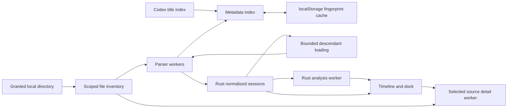

# Architecture

This is a local React/TypeScript application backed by one Rust engine compiled for native execution and WebAssembly. It serves static assets. Session contents never need an HTTP endpoint, an account, or a database server.

## Ownership

| Layer                            | Responsibility                                                                                                                                                                   |
| -------------------------------- | -------------------------------------------------------------------------------------------------------------------------------------------------------------------------------- |
| `crates/session-parser`          | Record compatibility, metadata, turn lifecycle, timing, tool classification, error status, agent references, linked spans, clipped statistics, and blocking-path reconstruction. |
| `src/workers/parser.worker.ts`   | Feed browser file streams into stateful Rust scanners; report progress and cancellation.                                                                                         |
| `src/workers/analysis.worker.ts` | Run the Rust relationship/statistics/path engine away from the main thread.                                                                                                      |
| `src/lib/session-store.ts`       | Browser permissions, scoped file discovery, metadata cache, and bounded asynchronous loading of the graph. No interpretation of tool payloads.                                   |
| `src/components/Timeline.tsx`    | Layout, viewport culling, drawing, selection, navigation, measurements, and keyboard input.                                                                                      |
| `src/App.tsx`                    | Directory guide, session list, scope navigation, loading/errors, and presentation of engine results.                                                                             |

The canonical browser contract is `src/types.ts`. Matching Rust structures use camelCase JSON serialization. WASM is generated by `scripts/build-wasm.sh`; generated bindings and binaries are ignored rather than treated as source.

The Rust crate has four implementation boundaries. `lib.rs` owns the streaming decoder, compatibility adapters and normalized records. `analysis.rs` derives communication edges, clipped aggregates and the blocking path from those records. `log.rs` projects the conversation into references to existing spans. `details.rs` reopens selected physical records for full content. Keeping analysis and the conversation projection downstream of normalization means every frontend consumes one interpretation of the session format.

The native library and WASM build share these modules. The small native `session-parser` CLI is an adapter for the same parse/detail/analysis exports, while the `benchmark` binary supplies bounded file decoding and aggregate validation. Valid results have the same JSON representation in both targets. Invalid selectors or analysis inputs return native Rust errors and throw JavaScript errors in WASM; native code must never call JavaScript error constructors.

## Engine contract

| Entry point                                      | Input and output                                                                                         | Intended use                                                                               |
| ------------------------------------------------ | -------------------------------------------------------------------------------------------------------- | ------------------------------------------------------------------------------------------ |
| `MetadataScanner`                                | Repeated decoded UTF-8 `push(chunk)`, then `finish()` returning `SessionMetadata` JSON                   | Stream indexable fields without building a trace.                                          |
| `SessionParser`                                  | The same streaming lifecycle, returning `ParsedSession` JSON                                             | Selected trace normalization.                                                              |
| `scan_metadata(text)`, `parse_session(text)`     | One text input and equivalent JSON output                                                                | Small fixtures, adapters and parity tests. Production browser loads use streaming classes. |
| `DetailParser(selectorJson)`                     | Stream the source again; `is_done()` permits early termination; `finish()` returns one full-content page | Read original `sourceLine`/`outputLine` records, with `callId` fallback and page offsets.  |
| `analyze_sessions(json, rootId, startMs, endMs)` | Loaded normalized sessions and finite time bounds → `{flows,path,statistics}`                            | Scope-aware relationships and critical-path analysis.                                      |
| `aggregate_spans(json)`                          | Selected normalized spans → aggregate operation rows                                                     | Multi-selection summaries.                                                                 |

Stateful scanner instances belong to one input stream and are freed after their final result. The browser's `TextDecoder` owns byte-to-text decoding; Rust owns JSONL framing across chunks, physical line numbering and bounded retention. Times are finite Unix milliseconds. Span IDs and their session IDs identify the normalized view; source line numbers are separate references into the original file. A generated inference interval can have no physical record, so it must not be used as a detail selector.

`ParsedSession` contains metadata, turns, spans, agent operations, log-entry references and diagnostics. `SessionMetadata` contains the individual thread identity, title/model/cwd, time extent, turn count, child IDs, optional lineage/display fields and record/elision counters. The browser adds file path/fingerprint/archive state to form a `SessionEntry`. This separation prevents filesystem details from entering the Rust timeline model and avoids putting prompt bodies in the metadata cache.

## Loading pipeline

1. A user gesture opens the directory picker with read access. The instructions explain Finder's Go to Folder and hidden-file shortcuts.
2. The store reads only `session_index.jsonl`, `sessions/`, and `archived_sessions/`. The index supplies titles. JSONL metadata supplies model, turn count, lineage, and timestamps.
3. An index cache is keyed by folder identity, relative path, size, modification time, and parser version. Cold scans stream small files first; warm scans validate file fingerprints.
4. Selecting a session sends its `File` reference to a parser worker. The worker feeds chunks into Rust and receives normalized spans and turns.
5. The UI always eagerly schedules descendants, with bounded parallelism. The core loading API retains lazy expansion for benchmarks and programmatic use. Snapshots update the visible graph while other children load.
6. Scope changes select one agent subtree and a whole-session or turn time range. Rust calculates the flows, statistics, and ordered blocking path for this range. Timeline code only positions and draws those results.

The index's file-size/mtime fingerprints are cache validation, not content hashes. A parser-version change invalidates old metadata, and a changed file is rescanned. Storage corruption, quota limits or blocked localStorage do not prevent loading; the store can rebuild the index. A directory handle and its stable folder identity live separately in IndexedDB. Restoring the handle does not assume that browser permission is still granted; a user gesture requests it again when necessary. Directory-upload fallback has no persistent handle or stable directory identity. Each selection has a separate in-memory cache; it is never mixed into the saved-directory cache.

Switching files or scopes cancels obsolete work. The store bounds concurrent parsing and graph expansion, reports unresolved children/errors, and progressively publishes the graph. The top-level session list excludes known descendants, but the underlying index retains them for graph lookup. Full prompts and outputs remain in the granted files, with detail pages loaded on selection; they are not duplicated in localStorage.

## Input trust and format boundaries

Every prompt, tool argument, generated code block and instruction inside a session file is data. Nothing read from the directory is evaluated or executed. The browser sends the selected `File` objects to its own workers, not to an HTTP upload endpoint. The static server only serves application assets. The store's allowlist excludes Codex credentials, configuration and SQLite databases even though the user grants the parent directory.

The current inventory assumes one plain `.jsonl` rollout per individual thread. It reads both active and archived trees, while newer physical history features such as compressed files, reverted rollout versions and `history_base` prefixes need additional version-resolution support. The exact supported fields, historical adapters and limitations are specified in [session-format.md](session-format.md). Accepting an unknown record does not mean reconstructing its unimplemented semantics.

## Track model

Each session/agent is a track group, corresponding to a Perfetto process. Tracks are `turns`, `inference`, `shell`, `files`, `skills`, `code`, `agent_dispatch`, `agent_wait`, `agent_messages`, `tools`, `web`, `approval`, `context`, `messages`, and `system`. Empty tracks are omitted. Overlapping operations are assigned additional lanes, without changing their timings. See [session-format.md](session-format.md) for the source-to-track mapping.

## Trace interpretation

Explicit lifecycle timestamps take precedence. The Rust engine reconstructs remaining operation boundaries from the best available event order. Internal provenance flags stay available for tests and future engine work; the interface presents the resulting timeline without “inferred” labels, per the user's explicit instruction.

The critical path is a reconstructed blocking chain, not an instrumentation-grade distributed scheduling proof. It removes nested wrapper double counting, clips work to scope, follows completed child work through waits, and preserves timeout waits. This distinction belongs in implementation documentation. The UI shows an ordered path table and red overlay. Selecting a path row keeps that tab open and loads the selected operation’s full details beside the table. Aggregate operations remain in the Statistics tab.

Failures remain part of normal slices: the renderer draws a red circle and white × at the right edge. Details retain status and bounded code/output previews; full recorded contents are available through detail pages. Highlight.js operates on escaped code and does not execute session contents.

## Performance and validation

The audited corpus contains hundreds of sessions and multi-gigabyte archive files. Whole-file `File.text()` and main-thread rollout JSONL parsing are intentionally absent from the production load path. Rust retains bounded records/details, and diagnostics disclose input records that exceed limits. See [session-format.md](session-format.md), [loading.md](loading.md), and [implementation-notes-loading.md](implementation-notes-loading.md).

Native tests exercise the same engine used by WASM. Browser tests cover the worker boundary and actual interactions. Real-corpus benchmarks are explicit local commands and write aggregate results to ignored output directories. CI uses synthetic fixtures only. Perfetto-derived algorithms, source revisions, and license notices are documented in [perfetto-reference.md](perfetto-reference.md).

Rust's workspace lint policy forbids unsafe code, denies unused must-use results and rejects debugging/placeholder macros. Standard Clippy and Rust idiom warnings are enabled; CI denies all warnings. The focused regression suites intentionally retain legacy adapters, inherited-history identity checks, malformed tails, Unicode paging, encrypted task labels and recursive waits. Those cases represent distinct saved-data failures rather than obsolete feature paths. The synthetic loading benchmark builds its fixture outside the timer, uses unique paired tool calls/results and validates completed-call counts after each timed run.

## Delivery

`npm run build` compiles Rust/WASM, type-checks TypeScript, and bundles a static site. CI builds and verifies on pull requests. Successful main pushes deploy the same-run static artifact to a dedicated Vercel origin, after Rust and browser verification. The deploy job packages only the allowlisted static files into Vercel Build Output API v3 format, with production CSP/cache headers and no SPA fallback. It never sends the checkout or local session data to Vercel. The live check verifies artifact bytes, MIME types, headers and missing-asset 404s. See [deployment.md](deployment.md).

## Session Log and live builds

Rust emits ordered `logEntries` referring to normalized spans; React does not reinterpret JSONL records. The dock renders a continuous, measured virtual list of messages and call/result entries using TanStack Virtual. It mounts the visible range plus a small overscan and at most two retained rows for expanded-content state and height correction. Full contents use the existing Rust detail parser; only very large individual payloads have content pages. Hover highlights a span without changing selection; activation centers it at the current zoom while retaining all agents, spans, scope and the Log tab. `F` explicitly zooms to the selection. Selected-span links and all links have independent `<` and `>` shortcuts; selected links are visible by default.

The virtualizer owns the log's sizer height and row transforms through direct DOM
updates; React owns the mounted rows and their contents. Deferred measurements
update scroll geometry together, without nested synchronous React renders.
Remeasured rows entirely above the viewport preserve the reading anchor even
during upward scrolling, including a retained expanded payload that rewraps when
the dock narrows.

Workers fetch the explicit bundled WASM URL and validate its binary header before initialization. A failed request is retried once and a rejected initialization can be retried later. Repeated local builds preserve prior hashed assets in `dist/` so a page that was already open can still start its workers after a rebuild. Fresh CI checkouts produce clean artifacts; delete `dist/` only when no old local clients need it.

Each hosted deployment uses a fresh, verified CI artifact. Vercel does not copy old
hashed files from earlier deployments into that artifact. An already-open hosted
page that encounters a retired worker/WASM URL can use the existing reload action;
HTML is revalidated and missing assets return 404 instead of the app document.
